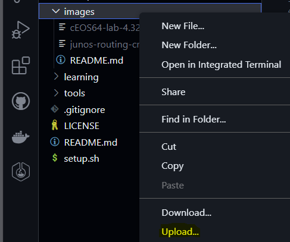

# Network Programmability and Automation showcases

Welcome!

Here you will find a bunch of ready to go labs based on a wide variety of network topologies and automation concepts using Containerlab as the orchestration engine.

This is mostly just for my own personal learning and mentoring, but I have made it public in case it helps anyone else who may be in the same situation!

- [Network Programmability and Automation showcases](#network-programmability-and-automation-showcases)
  - [Setup](#setup)
    - [Locally](#locally)
    - [Codespaces](#codespaces)
    - [Setup script](#setup-script)
    - [NOS images](#nos-images)
      - [NOS images in Codespaces](#nos-images-in-codespaces)
  - [Design Brief](#design-brief)
  - [Design Detail](#design-detail)

## Setup

### Locally

If working locally, clone this repo to an area of your choosing. Most labs should work with 8Gb of free Memory to align with the default codespaces specs but it will be called out if more is required.

Next, install Containerlab following the steps at https://containerlab.dev/install/

Verify you're all good to go with `containerlab version`

### Codespaces

Click the button below to launch this repo in a new codespace with Containerlab already installed

[](https://codespaces.new/commitconfirmed/npa-showcases?quickstart=1&devcontainer_path=.devcontainer%2Fcontainerlab%2Fdevcontainer.json)

Most labs will work on the 2-core / 8Gb Memory Machine Type unless specifically called out in the labs README.md

### Setup script

To download and build all the Docker containers used in our labs at once, simply run the `setup.sh` script. Note that this will take quite a while. If you would prefer not to wait each lab [example](./examples/) has a script that you can run to only build that particulars labs Docker containers (`manage.sh build`)

### NOS images

At this time, Juniper and Arista do not have publicly available images on the container registry, so these will need to be manually loaded and then tagged with "latest" so that they can be used in this repos provided examples. This also allows us to easily upgrade (or downgrade) to a new image version without having to modify all the Containerlab .clab files.

To download these images, you will need to register an account (free) on the Arista and Juniper websites and then download the NOS container images (URLs below):

- https://support.juniper.net/support/downloads/?p=crpdtrial (23.2R1 was used in this example)
- https://www.arista.com/en/support/software-download (cEOS64-lab-4.32.5.1M.tar.xz was used in this example)

From here, copy the images into the `./images` folder and load them, and pull the Nokia SRL image from the registry. Commands are below:

```bash
❯ sudo docker image pull ghcr.io/nokia/srlinux
Using default tag: latest
--snip--
❯ sudo docker import images/cEOS64-lab-4.32.5.1M.tar.xz ceos:latest
sha256:70314310c219009aa903f9ce57f1eef4a72337f21dc3b778179724203c8a31f1
❯ sudo docker image load -i images/junos-routing-crpd-docker-amd64-23.2R1.13.tgz
Loaded image: crpd:23.2R1.13
❯ sudo docker image tag crpd:23.2R1.13 crpd:latest
```

When you have loaded/imported/pulled all the NOS images and tagged the Juniper CRPD image with latest, you should see something similar to the below when executing `sudo docker image list`

```bash
❯ sudo docker image list
REPOSITORY                                  TAG           IMAGE ID       CREATED         SIZE
ceos                                        latest        70314310c219   3 minutes ago    2.45GB
ghcr.io/nokia/srlinux                       latest        afd4d4a4aee0   6 weeks ago      2.2GB
crpd                                        23.2R1.13     0cf5adbda509   22 months ago    498MB
crpd                                        latest        0cf5adbda509   22 months ago    498MB
❯ 
```

> Note: The Evaluation Juniper cRPD image only has limited functionality (OSPF, ISIS & Static Routing). Full functionality requires a license.

#### NOS images in Codespaces

To upload a NOS image into your codespaces from your local machine, simply right click the images folder and select upload: 



## Design Brief

The a brief overview of this repos folder structure below. Each of these folders has its own README.md file with more information if required.

- [.devcontainer](./.devcontainer/): The Dev Container details used in a codespaces deployment
- [composers](./composers/): Products that require Docker Compose to run (i.e. Netbox)
- [containers](./containers/): Ready to go container Dockerfiles for a variety of products (Nornir, Ansible, GoBGP, etc.)
- [examples](./examples/): The Main area of this repo. Contains our NPA showcases
- [images](./images/): A place to store images that are not publicly available (i.e. Arista cEOS)
- [learning](./learning/): My personal scrap area while I'm learning and tinkering with things. Will eventually delete
- [tools](./tools/): Some basic scripts that are not lab specific (i.e. doing traffic captures)

## Design Detail

TBD
